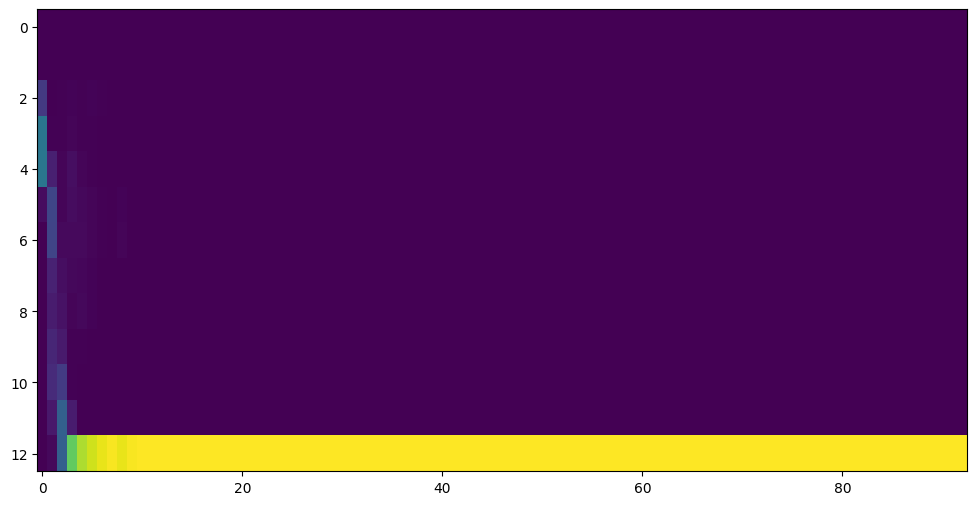

# KhehUe-HapSing
自 https://github.com/fatchord/WaveRNN 來訓練。

## 安
- [dobi](https://github.com/dnephin/dobi)
- [docker](https://docs.docker.com/engine/installation/linux/docker-ce/ubuntu/)
- [docker-compose](https://docs.docker.com/compose/install/)
- 設定docker權限`sudo usermod -aG docker $USER`

## 訓練步
1. 先用`time dobi hazoi-ngiliau`，會下載客語教典詞音檔，下載好會恁樣：
```
1-ciidien-20190516/
├── corpus
│   ├── s_sound
│   │   ├── 00001.mp3
│   │   ├── 00002.mp3
│   │   ├── ...
│   │   └── 15486.mp3
│   ├── s_sound2
│   │   └── ...
│   ├── s_sound3
│   │   └── ...
│   ├── s_sound4
│   │   └── ...
│   ├── s_sound5
│   │   └── ...
│   └── s_sound6
│        └── ...
└── moe-hakkadict-main
    ├── README.md
    ├── 調值資料_raw
    │   ├── 《臺灣客家語常用詞辭典》內容資料(1100430).csv
    │   ├── 《臺灣客家語常用詞辭典》內容資料(1100430).ods
    │   └── 《臺灣客家語常用詞辭典》內容資料(1100430).pdf
    ├── 調值資料_uni
    │   └── 《臺灣客家語常用詞辭典》內容資料(1100430).csv
    ├── 調型資料
    │   └── 《臺灣客家語常用詞辭典》內容資料(1100430).csv
    └── 轉做調型資料.py
```
2. `time dobi zon-bienma`，毋愛頭尾無聲个部份，tacotron較會收斂，而且wave downsample 乜降做 16bits wav，盡尾合成較遽。
```
2-ciidien-20190516-16k/
├── corpus
│   ├── s_sound
│   │   ├── 00001.mp3.wav
│   │   ├── 00002.mp3.wav
│   │   ├── ...
│   │   └── 15486.mp3.wav
│   ├── s_sound2
│   │   └── ...
│   ├── s_sound3
│   │   └── ...
│   ├── s_sound4
│   │   └── ...
│   ├── s_sound5
│   │   └── ...
│   └── s_sound6
│        └── ...
└── moe-hakkadict-main
    ├── README.md
    ├── 調值資料_raw
    │   ├── 《臺灣客家語常用詞辭典》內容資料(1100430).csv
    │   ├── 《臺灣客家語常用詞辭典》內容資料(1100430).ods
    │   └── 《臺灣客家語常用詞辭典》內容資料(1100430).pdf
    ├── 調值資料_uni
    │   └── 《臺灣客家語常用詞辭典》內容資料(1100430).csv
    ├── 調型資料
    │   └── 《臺灣客家語常用詞辭典》內容資料(1100430).csv
    └── 轉做調型資料.py
```
3. `time dobi preprocess-tacotron`，準備tactorn格式，產生音檔長短`dataset.pkl`，音檔羅馬字對應`text_dict.pkl`、音檔頻譜`mel/`、音檔波形sample`quant/`。
```
3-ciidien-20190516-16k-MeuLid-data/
├── dataset.pkl
├── gta
├── mel
│   ├── 00001.mp3.npy
│   ├── 00002.mp3.npy
│   ├── ...
│   └── 15450.mp3.npy
├── quant
│   ├── 00001.mp3.npy
│   ├── 00002.mp3.npy
│   ├── ...
│   └── 15450.mp3.npy
└── text_dict.pkl
```
4. `time dobi tacotron`，訓練Tacotron模型。盡尾會產生`gta/`檔案。`gta/`係[Ground Truth Aligned synthesis](https://github.com/Rayhane-mamah/Tacotron-2#synthesis)用个，[Ground Truth相關資料](https://www.aptiv.com/en/insights/article/what-is-ground-truth)。
```
4-ciidien-20190516-16k-MeuLid-checkpoints/
├── khehue_lsa_smooth_attention.tacotron
│   ├── attention
│   │   ├── 100463.png
│   │   ├── 101429.png
│   │   └── ...
│   ├── latest_optim.pyt
│   ├── latest_weights.pyt
│   ├── log.txt
│   ├── mel_plots
│   │   ├── 100463.png
│   │   ├── 101429.png
│   │   └── ...
│   ├── taco_step100K_optim.pyt
│   ├── taco_step100K_weights.pyt
│   ├── ...
│   ├── taco_step98K_optim.pyt
│   └── taco_step98K_weights.pyt
└── khehue_raw.wavernn
```

- 10000steps个時節愛有線，代表tacotron學着對應`羅馬字`摎`mel/`。假使無，請檢查`text_dict.pkl`對應有著無。
  - 成功个（`4-ciidien-20190516-16k-MeuLid-checkpoints/khehue_lsa_smooth_attention.tacotron/attention/9659.png`）
  
  - 失敗个（`4-ciidien-20190516-16k-MeuLid-checkpoints/khehue_lsa_smooth_attention.tacotron/attention/9658.png`）
  

4-1. 假使在tactorn訓練時節，愛產生`gta/`檔案，走`time dobi tacotron-gta`

4-2. `time dobi habsang`，試合成語句。因為wavernn吂做，故所有程式毋著係著个。會產生`Tacotron`摎`griffinlim`个音檔。`griffinlim`个音檔有電子聲，故所愛訓練`WaveRNN`分聲像人講話。
```
5-ciidien-20190516-16k-MeuLid-model_outputs/
├── khehue_lsa_smooth_attention.tacotron
│   └── __input_Kiung ha l_griffinlim_350k.wav
└ ...
```
5. `time dobi preprocess-wavernn`，因為太長个音檔無法度用訓練tacotron，會無法度coverage。`hparams.py`有設定`tts_max_mel_len`，故所`gta/`無全部音檔有。這指令照`gta/`檔案，產生wavernn愛个`dataset_wavernn.pkl`。
```
3-ciidien-20190516-16k-MeuLid-data/
├── dataset.pkl
├── dataset_wavernn.pkl
└── ...

```
6. `time dobi wavernn`，訓練WaveRNN模型。`4-ciidien-20190516-16k-MeuLid-checkpoints/khehue_raw.wavernn`係模型，`5-ciidien-20190516-16k-MeuLid-model_outputs/khehue_raw.wavernn`做得聽結果。
```
4-ciidien-20190516-16k-MeuLid-checkpoints/
├── khehue_lsa_smooth_attention.tacotron
│   └── ...
└── khehue_raw.wavernn
    ├── latest_optim.pyt
    ├── latest_weights.pyt
    ├── log.txt
    ├── wave_step100K_optim.pyt
    ├── wave_step100K_weights.pyt
    └── ...

5-ciidien-20190516-16k-MeuLid-model_outputs/
├── khehue_lsa_smooth_attention.tacotron
└── khehue_raw.wavernn
    ├── 1000k_steps_1_gen_batched_target4000_overlap400.wav
    ├── 1000k_steps_1_target.wav
    ├── 1000k_steps_2_gen_batched_target4000_overlap400.wav
    ├── 1000k_steps_2_target.wav
    └── ...
```
7. `time dobi habsang`，合成語句。
```
5-ciidien-20190516-16k-MeuLid-model_outputs/
├── khehue_lsa_smooth_attention.tacotron
│   ├── __input_Kiung ha l_griffinlim_350k.wav
│   ├── __input_Kiung ha l_wavernn_batched_350k.wav
│   └── __input_Kiung ha l_wavernn_unbatched_350k.wav
└── khehue_raw.wavernn
    └── ...

```

### 定服務
```
docker-compose up --build
```


#### Pau--khi-lai
```
time dobi hokbu-khuanking
# GPU
docker run --rm -ti -e CUDA_VISIBLE_DEVICES=1 -v `pwd`/kiatko:/kiatko -p 5000:5000 i3thuan5/suisiann-wavernn:SuiSiann-WaveRNN-HokBu-fafoy
# CPU
docker run --rm -ti -e FORCE_CPU=True -v `pwd`/kiatko:/kiatko -p 5000:5000 i3thuan5/suisiann-wavernn:SuiSiann-WaveRNN-HokBu-fafoy
```
```

curl -i -X POST -H "Content-Type: application/json"  \
    -d '[
        {"src": "我 打 籃 球 時 手 扭 傷 ， 醫 生 說 要 打 石 膏 。 ", "id": 1},
        {"src": "黃 槿 樹 的 葉 子 ， 一 片 差 不 多 手 掌 一 般 大 。 ", "id": 1}
    ]' \
    "http://localhost:5000/translate"

```
##### Tshi(舊)
Python
```python
from http.client import HTTPConnection
from urllib.parse import urlencode

參數 = urlencode({
    'toivun': 'tak10-ke7 tsə2-hue1 lai7 tsʰit8-tʰə5 !',
    'socai': 'cii.wav',
})
headers = {
    "Content-type": "application/x-www-form-urlencoded",
    "Accept": "text/plain"
}
it_conn = HTTPConnection('localhost', port=5000)
it_conn.request("POST", '/', 參數, headers)
it_conn.getresponse().read()
```
